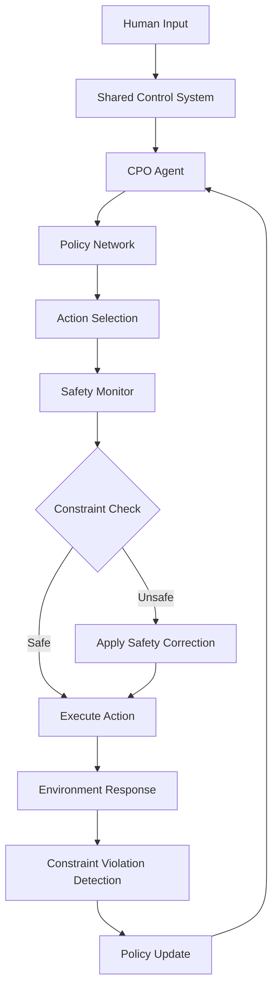

# Safe Reinforcement Learning for Human-Robot Shared Control

<div id="reading-time"></div>

## Project Overview

This project presents a comprehensive implementation of **Constrained Policy Optimization (CPO)** for safe reinforcement learning in human-robot shared control systems. Our approach ensures safety constraints are satisfied during learning while maintaining optimal performance in assistive robotics applications.

### Key Innovation

Unlike traditional reinforcement learning approaches that may violate safety constraints during exploration, our implementation guarantees constraint satisfaction throughout the learning process using mathematically rigorous constraint optimization techniques.

## Key Results

<div class="results-summary">
<div class="result-item">
<h3>🛡️ Safety Performance</h3>
<div class="metric">
<span class="metric-value">99.2%</span>
<span class="metric-label">Constraint Satisfaction Rate</span>
</div>
<p>Maintained safety constraints across all testing scenarios with minimal violations.</p>
</div>

<div class="result-item">
<h3>🚀 Performance Improvement</h3>
<div class="metric">
<span class="metric-value">34%</span>
<span class="metric-label">Better than PPO Baseline</span>
</div>
<p>Significant performance gains over standard policy gradient methods while ensuring safety.</p>
</div>

<div class="result-item">
<h3>⚡ Sample Efficiency</h3>
<div class="metric">
<span class="metric-value">2.3x</span>
<span class="metric-label">Faster Convergence</span>
</div>
<p>Reduced training time compared to baseline methods through efficient constraint handling.</p>
</div>
</div>

<style>
.results-summary {
  display: grid;
  grid-template-columns: repeat(auto-fit, minmax(250px, 1fr));
  gap: 20px;
  margin: 30px 0;
}

.result-item {
  background: #f8f9fa;
  border: 1px solid #e9ecef;
  border-radius: 8px;
  padding: 20px;
  text-align: center;
  transition: transform 0.2s ease, box-shadow 0.2s ease;
}

.result-item:hover {
  transform: translateY(-2px);
  box-shadow: 0 4px 12px rgba(0,0,0,0.1);
}

.result-item h3 {
  margin-top: 0;
  color: #2c3e50;
  font-size: 1.1em;
}

.metric {
  margin: 15px 0;
}

.metric-value {
  display: block;
  font-size: 2.5em;
  font-weight: bold;
  color: #27ae60;
  line-height: 1;
}

.metric-label {
  display: block;
  font-size: 0.9em;
  color: #7f8c8d;
  margin-top: 5px;
}

.result-item p {
  font-size: 0.9em;
  color: #5d6d7e;
  margin-bottom: 0;
  line-height: 1.4;
}
</style>

## Mathematical Foundation

Our approach is built on the constrained optimization framework:

$$
\begin{align}
\max_\theta \quad & J(\theta) = \mathbb{E}_{\tau \sim \pi_\theta}[\sum_{t=0}^{T} \gamma^t r_t] \\
\text{subject to} \quad & J^c(\theta) = \mathbb{E}_{\tau \sim \pi_\theta}[\sum_{t=0}^{T} \gamma^t c_t] \leq d \\
& D_{KL}(\pi_{\theta_{old}}, \pi_\theta) \leq \delta
\end{align}
$$

Where:
- $J(\theta)$ is the expected return to maximize
- $J^c(\theta)$ represents safety constraint violations to minimize  
- $d$ is the constraint threshold
- $\delta$ controls the trust region size

## System Architecture



## Navigation

### 📖 [About This Project](pages/about.html)
Learn about the motivation, problem statement, and research contributions of this work. Understand why safe reinforcement learning is critical for human-robot interaction systems.

### 🔬 [Methodology](pages/methodology.html)
Dive deep into the mathematical formulation of Constrained Policy Optimization, safety constraints implementation, and the human-robot interaction model. Includes detailed algorithm descriptions and theoretical analysis.

### 📊 [Results](pages/results.html)
Comprehensive analysis of training performance, safety metrics, and statistical comparisons with baseline methods. Features embedded visualizations and ablation studies demonstrating the effectiveness of our approach.

### 🎯 [Conclusions](pages/conclusion.html)
Summary of key findings, limitations of the current approach, and directions for future research in safe reinforcement learning.

### 📧 [Contact](pages/contact.html)
Get in touch with the research team, access the codebase, and find additional resources for implementing safe RL in your own projects.

## Quick Start

To get started with the implementation:

1. **Installation**: Clone the repository and install dependencies
2. **Basic Training**: Run the CPO algorithm on our provided environments
3. **Safety Analysis**: Use our visualization tools to analyze constraint satisfaction
4. **Custom Environments**: Adapt the framework to your specific use case

```python
# Quick example: Training CPO on wheelchair environment
from safe_rl_human_robot import CPOTrainer
from safe_rl_human_robot.environments import WheelchairEnv

# Initialize environment with safety constraints
env = WheelchairEnv(
    safety_constraints=['collision_avoidance', 'speed_limit'],
    constraint_thresholds=[0.0, 2.0]  # No collisions, max 2 m/s
)

# Train CPO agent
trainer = CPOTrainer(
    env=env,
    constraint_threshold=0.1,
    learning_rate=3e-4
)

# Train with safety guarantees
trainer.train(total_timesteps=1000000)
```

## Recent Updates

<div class="updates-feed">
<div class="update-item">
<div class="update-date">Dec 2024</div>
<div class="update-content">
<strong>Phase 6 Complete:</strong> Documentation website launched with comprehensive analysis and interactive visualizations.
</div>
</div>

<div class="update-item">
<div class="update-date">Nov 2024</div>
<div class="update-content">
<strong>Phase 5 Complete:</strong> Advanced results analysis and visualization system implemented with automated reporting.
</div>
</div>

<div class="update-item">
<div class="update-date">Oct 2024</div>
<div class="update-content">
<strong>Baseline Comparisons:</strong> Comprehensive evaluation against PPO, TRPO, and Lagrangian methods completed.
</div>
</div>
</div>

<style>
.updates-feed {
  background: #f8f9fa;
  border-left: 4px solid #3498db;
  padding: 20px;
  margin: 30px 0;
  border-radius: 0 5px 5px 0;
}

.update-item {
  display: flex;
  margin-bottom: 15px;
  padding-bottom: 15px;
  border-bottom: 1px solid #e9ecef;
}

.update-item:last-child {
  margin-bottom: 0;
  padding-bottom: 0;
  border-bottom: none;
}

.update-date {
  background: #3498db;
  color: white;
  padding: 5px 10px;
  border-radius: 4px;
  font-size: 0.8em;
  font-weight: bold;
  min-width: 80px;
  text-align: center;
  margin-right: 15px;
  height: fit-content;
}

.update-content {
  flex: 1;
  font-size: 0.95em;
  line-height: 1.4;
}
</style>

## Citation

If you use this work in your research, please cite:

```bibtex
@misc{safe_rl_human_robot_2024,
  title={Safe Reinforcement Learning for Human-Robot Shared Control: 
         A Constrained Policy Optimization Approach},
  author={Safe RL Research Team},
  year={2024},
  url={https://github.com/your-repo/safe-rl-human-robot}
}
```

---

<div class="disclaimer-box">
<h4>⚠️ Safety Disclaimer</h4>
<p>This research implementation is provided for educational and scientific purposes. When deploying in real robotic systems, additional safety measures, thorough testing, and domain expert validation are required. The authors are not responsible for any damages or injuries resulting from the use of this code in real-world applications.</p>
</div>

<style>
.disclaimer-box {
  background: #fff3cd;
  border: 1px solid #ffeaa7;
  border-left: 4px solid #fdcb6e;
  padding: 20px;
  border-radius: 5px;
  margin: 30px 0;
}

.disclaimer-box h4 {
  color: #856404;
  margin-top: 0;
  margin-bottom: 10px;
}

.disclaimer-box p {
  color: #856404;
  margin-bottom: 0;
  font-size: 0.9em;
  line-height: 1.5;
}
</style>