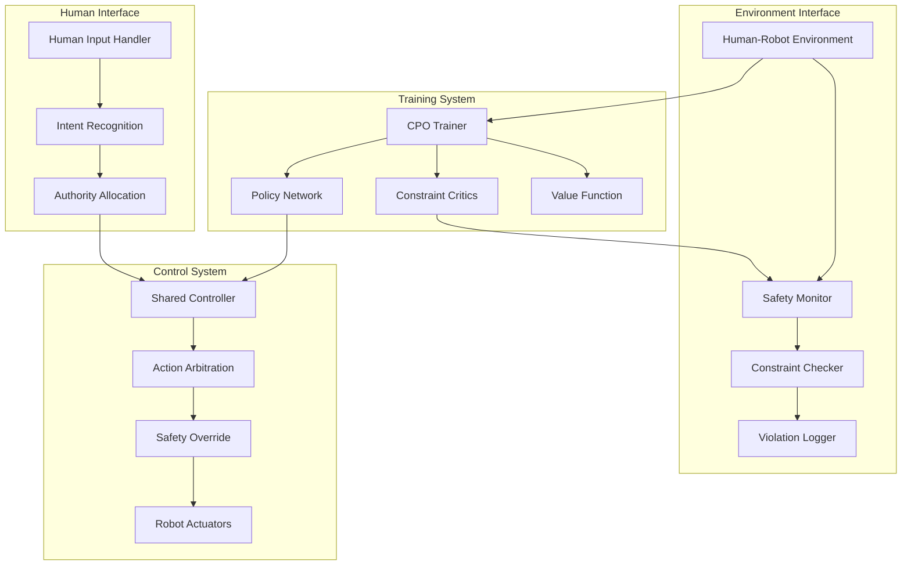

# Methodology

<div id="reading-time"></div>
<div id="table-of-contents"></div>

## Constrained Policy Optimization

### Mathematical Foundation

Constrained Policy Optimization (CPO) extends traditional policy gradient methods to handle safety constraints directly in the optimization objective. The fundamental problem formulation is:

$$
\begin{align}
\pi^* = \arg\max_{\pi} \quad & \eta(\pi) = \mathbb{E}_{\tau \sim \pi}\left[\sum_{t=0}^{T-1} \gamma^t r_t\right] \\
\text{subject to} \quad & J^c_i(\pi) = \mathbb{E}_{\tau \sim \pi}\left[\sum_{t=0}^{T-1} \gamma^t c_{i,t}\right] \leq d_i, \quad \forall i \in \{1, 2, \ldots, m\}
\end{align}
$$

Where:
- $\eta(\pi)$ is the expected discounted return
- $J^c_i(\pi)$ represents the expected discounted cost for constraint $i$
- $d_i$ is the threshold for constraint $i$
- $\gamma \in [0,1)$ is the discount factor
- $m$ is the number of constraints

### Trust Region Formulation

To ensure stable learning, we incorporate trust region constraints following the TRPO methodology:

$$
\begin{align}
\max_{\theta} \quad & \mathbb{E}_{s,a \sim \pi_{\theta_k}}\left[\frac{\pi_\theta(a|s)}{\pi_{\theta_k}(a|s)} A^{\pi_{\theta_k}}(s,a)\right] \\
\text{subject to} \quad & \bar{D}_{KL}(\pi_{\theta_k}, \pi_\theta) \leq \delta \\
& J^c_i(\pi_\theta) \leq d_i, \quad \forall i
\end{align}
$$

The KL divergence constraint ensures that policy updates remain within a trust region:

$$
\bar{D}_{KL}(\pi_{\theta_k}, \pi_\theta) = \mathbb{E}_{s \sim \rho^{\pi_{\theta_k}}}[D_{KL}(\pi_{\theta_k}(\cdot|s) \| \pi_\theta(\cdot|s))]
$$

### Lagrangian Approach

The constrained optimization problem is solved using the Lagrangian method. The Lagrangian function is:

$$
\mathcal{L}(\theta, \lambda) = \eta(\pi_\theta) - \sum_{i=1}^{m} \lambda_i (J^c_i(\pi_\theta) - d_i)
$$

Where $\lambda_i \geq 0$ are the Lagrange multipliers for each constraint.

The optimality conditions (KKT conditions) require:

1. **Stationarity**: $\nabla_\theta \mathcal{L}(\theta^*, \lambda^*) = 0$
2. **Primal feasibility**: $J^c_i(\pi_{\theta^*}) \leq d_i, \forall i$
3. **Dual feasibility**: $\lambda_i^* \geq 0, \forall i$  
4. **Complementary slackness**: $\lambda_i^* (J^c_i(\pi_{\theta^*}) - d_i) = 0, \forall i$

### Practical Algorithm Implementation

Our CPO implementation uses a two-step approach:

#### Step 1: Unconstrained Policy Update

First, we compute the optimal policy update ignoring constraints:

$$
\theta_u = \arg\max_\theta \mathbb{E}_{s,a \sim \pi_{\theta_k}}\left[\frac{\pi_\theta(a|s)}{\pi_{\theta_k}(a|s)} A^{\pi_{\theta_k}}(s,a)\right]
$$

Subject only to the trust region constraint:
$$
\bar{D}_{KL}(\pi_{\theta_k}, \pi_\theta) \leq \delta
$$

#### Step 2: Constraint Projection

If the unconstrained update violates safety constraints, we project onto the constraint boundary:

$$
\theta_{k+1} = \theta_k + \alpha \max\left(0, \frac{\sqrt{2\delta}}{|\sqrt{g^T H^{-1} g}|}\right) H^{-1} g
$$

Where:
- $g = \nabla_\theta \eta(\pi_\theta)|_{\theta_k}$ is the policy gradient
- $H = \nabla_\theta^2 \bar{D}_{KL}(\pi_{\theta_k}, \pi_\theta)|_{\theta_k}$ is the Fisher information matrix
- $\alpha$ is determined by constraint satisfaction

```python
# CPO Update Step Implementation
def cpo_update(self, states, actions, advantages, constraint_violations):
    """
    Constrained Policy Optimization update step.
    
    Args:
        states: State observations
        actions: Actions taken
        advantages: Advantage estimates
        constraint_violations: Constraint violation signals
    """
    # Compute policy gradient
    policy_gradient = self.compute_policy_gradient(states, actions, advantages)
    
    # Compute constraint gradients
    constraint_gradients = []
    for i, violations in enumerate(constraint_violations):
        grad = self.compute_constraint_gradient(states, actions, violations, i)
        constraint_gradients.append(grad)
    
    # Solve constrained optimization problem
    if self.constraint_violations_detected(constraint_violations):
        # Use Lagrangian method for constrained update
        update_direction = self.solve_constrained_optimization(
            policy_gradient, constraint_gradients
        )
    else:
        # Standard policy gradient update
        update_direction = self.solve_trust_region_update(policy_gradient)
    
    # Apply update with line search
    step_size = self.line_search(update_direction, constraint_violations)
    self.policy.update_parameters(step_size * update_direction)
    
    # Update Lagrange multipliers
    self.update_lagrange_multipliers(constraint_violations)
```

## Safety Constraints

### Constraint Types and Mathematical Formulation

Our framework supports multiple types of safety constraints commonly encountered in human-robot interaction:

#### 1. State-Based Constraints

Constraints that depend only on the current state:

$$
c^{\text{state}}_t = \mathbb{I}[s_t \in \mathcal{S}_{\text{unsafe}}]
$$

Examples include:
- **Collision avoidance**: $c^{\text{collision}}_t = \mathbb{I}[d_{\text{obstacle}}(s_t) < d_{\text{min}}]$
- **Workspace boundaries**: $c^{\text{boundary}}_t = \mathbb{I}[s_t \notin \mathcal{W}_{\text{safe}}]$

#### 2. Action-Based Constraints  

Constraints on the actions themselves:

$$
c^{\text{action}}_t = \mathbb{I}[|a_t| > a_{\text{max}}]
$$

Examples:
- **Velocity limits**: $c^{\text{velocity}}_t = \mathbb{I}[\|v_t\| > v_{\text{max}}]$
- **Acceleration limits**: $c^{\text{accel}}_t = \mathbb{I}[\|a_t\| > a_{\text{max}}]$

#### 3. Temporal Constraints

Constraints that consider sequences of states/actions:

$$
c^{\text{temporal}}_t = \mathbb{I}\left[\sum_{k=0}^{t} \gamma^k f(s_k, a_k) > \tau\right]
$$

Examples:
- **Cumulative risk**: $c^{\text{risk}}_t = \mathbb{I}[\sum_{k=0}^{t} \text{risk}(s_k) > R_{\text{max}}]$

### Constraint Violation Detection

We implement a multi-layered approach to constraint violation detection:

```python
class SafetyMonitor:
    """Real-time safety constraint monitoring system."""
    
    def __init__(self, constraints, thresholds):
        self.constraints = constraints
        self.thresholds = thresholds
        self.violation_buffer = deque(maxlen=100)
    
    def check_constraints(self, state, action, next_state):
        """
        Check all safety constraints for current transition.
        
        Returns:
            violations: Dict mapping constraint names to violation amounts
            is_safe: Boolean indicating if all constraints satisfied
        """
        violations = {}
        
        for constraint_name, constraint_func in self.constraints.items():
            violation = constraint_func(state, action, next_state)
            violations[constraint_name] = violation
            
            # Log violation for trend analysis
            if violation > self.thresholds[constraint_name]:
                self.violation_buffer.append({
                    'constraint': constraint_name,
                    'violation': violation,
                    'timestamp': time.time(),
                    'state': state.copy(),
                    'action': action.copy()
                })
        
        is_safe = all(v <= self.thresholds[k] for k, v in violations.items())
        return violations, is_safe
    
    def get_constraint_statistics(self):
        """Compute constraint violation statistics."""
        if not self.violation_buffer:
            return {}
        
        stats = {}
        for constraint_name in self.constraints.keys():
            constraint_violations = [
                v for v in self.violation_buffer 
                if v['constraint'] == constraint_name
            ]
            
            if constraint_violations:
                violations = [v['violation'] for v in constraint_violations]
                stats[constraint_name] = {
                    'count': len(violations),
                    'rate': len(violations) / len(self.violation_buffer),
                    'mean_violation': np.mean(violations),
                    'max_violation': np.max(violations)
                }
        
        return stats
```

### Constraint Value Function Estimation

To enforce constraints, we need to estimate constraint value functions. We use a separate critic network for each constraint:

$$
V^{c_i}_\pi(s) = \mathbb{E}_{\tau \sim \pi}\left[\sum_{t=0}^{T-1} \gamma^t c_{i,t} \mid s_0 = s\right]
$$

The constraint advantage function is:

$$
A^{c_i}_\pi(s,a) = Q^{c_i}_\pi(s,a) - V^{c_i}_\pi(s)
$$

Where $Q^{c_i}_\pi(s,a)$ is the constraint action-value function.

## Human-Robot Interaction Model

### Shared Control Framework

Our shared control model combines human input with autonomous robot control:

$$
a_t = \alpha_t \cdot a^{\text{human}}_t + (1-\alpha_t) \cdot a^{\text{robot}}_t
$$

Where:
- $\alpha_t \in [0,1]$ is the dynamic authority allocation
- $a^{\text{human}}_t$ is the human's desired action
- $a^{\text{robot}}_t$ is the robot's autonomous action

### Authority Allocation

The authority parameter $\alpha_t$ is determined based on:

1. **Human Intent Confidence**:
   $$
   \text{conf}_{\text{human}}(t) = \exp\left(-\frac{\|\dot{a}^{\text{human}}_t\|^2}{2\sigma^2}\right)
   $$

2. **Safety Assessment**:
   $$
   \text{safety}(t) = \prod_{i=1}^{m} \left(1 - \frac{J^c_i(\pi_t)}{d_i}\right)_+
   $$

3. **Task Performance**:
   $$
   \text{perf}(t) = \frac{Q_\pi(s_t, a^{\text{human}}_t)}{Q_\pi(s_t, a^{\text{robot}}_t)}
   $$

The authority allocation function combines these factors:

$$
\alpha_t = \sigma\left(w_1 \cdot \text{conf}_{\text{human}}(t) + w_2 \cdot \text{safety}(t) + w_3 \cdot \text{perf}(t)\right)
$$

Where $\sigma(\cdot)$ is the sigmoid function and $w_i$ are learned weights.

### Human Model Learning

We model human behavior using a Gaussian policy:

$$
\pi^{\text{human}}(a|s) = \mathcal{N}(a; \mu^{\text{human}}(s), \Sigma^{\text{human}}(s))
$$

The human model parameters are learned online using maximum likelihood estimation:

$$
\theta^{\text{human}}_{t+1} = \theta^{\text{human}}_t + \eta \nabla_\theta \log \pi^{\text{human}}_\theta(a^{\text{human}}_t | s_t)
$$

## Implementation Architecture

### System Design Overview

Our implementation follows a modular architecture with clear separation of concerns:



### Core Components

#### 1. CPO Agent

The main CPO agent implements the constrained optimization algorithm:

```python
class CPOAgent:
    """Constrained Policy Optimization agent for safe RL."""
    
    def __init__(self, state_dim, action_dim, constraints, config):
        self.state_dim = state_dim
        self.action_dim = action_dim
        self.constraints = constraints
        
        # Neural networks
        self.policy = PolicyNetwork(state_dim, action_dim)
        self.value_function = ValueNetwork(state_dim)
        self.constraint_critics = [
            ConstraintCritic(state_dim) for _ in constraints
        ]
        
        # Optimization components
        self.lagrange_multipliers = np.zeros(len(constraints))
        self.trust_region_solver = TrustRegionSolver(config.delta)
        
    def update(self, batch):
        """Perform CPO update step."""
        # Compute advantages
        advantages = self.compute_advantages(batch)
        constraint_advantages = [
            critic.compute_advantages(batch) 
            for critic in self.constraint_critics
        ]
        
        # Check constraint violations
        constraint_violations = self.evaluate_constraints(batch)
        
        # Perform constrained policy update
        if np.any(constraint_violations > self.constraint_thresholds):
            self.constrained_update(advantages, constraint_advantages, batch)
        else:
            self.unconstrained_update(advantages, batch)
        
        # Update constraint critics
        for i, critic in enumerate(self.constraint_critics):
            critic.update(batch, i)
        
        # Update value function
        self.value_function.update(batch)
```

#### 2. Constraint Management

Our constraint management system provides flexible constraint definition and evaluation:

```python
class ConstraintManager:
    """Manages multiple safety constraints."""
    
    def __init__(self):
        self.constraints = {}
        self.thresholds = {}
        self.weights = {}
    
    def add_constraint(self, name, constraint_func, threshold, weight=1.0):
        """Add a new safety constraint."""
        self.constraints[name] = constraint_func
        self.thresholds[name] = threshold
        self.weights[name] = weight
    
    def evaluate_all(self, state, action, next_state):
        """Evaluate all constraints for a transition."""
        violations = {}
        for name, constraint in self.constraints.items():
            violation = constraint(state, action, next_state)
            violations[name] = {
                'value': violation,
                'threshold': self.thresholds[name],
                'weight': self.weights[name],
                'violated': violation > self.thresholds[name]
            }
        return violations
    
    def compute_constraint_cost(self, violations):
        """Compute weighted constraint cost."""
        total_cost = 0.0
        for name, violation in violations.items():
            if violation['violated']:
                cost = violation['weight'] * max(0, violation['value'] - violation['threshold'])
                total_cost += cost
        return total_cost
```

### Neural Network Architectures

#### Policy Network

The policy network uses a Gaussian policy representation:

$$
\pi_\theta(a|s) = \mathcal{N}(a; \mu_\theta(s), \sigma_\theta(s))
$$

```python
class PolicyNetwork(nn.Module):
    """Gaussian policy network for continuous control."""
    
    def __init__(self, state_dim, action_dim, hidden_sizes=[256, 256]):
        super().__init__()
        
        # Shared layers
        layers = []
        prev_size = state_dim
        for size in hidden_sizes:
            layers.extend([
                nn.Linear(prev_size, size),
                nn.ReLU(),
                nn.LayerNorm(size)
            ])
            prev_size = size
        
        self.shared_layers = nn.Sequential(*layers)
        
        # Policy head
        self.mean_head = nn.Linear(prev_size, action_dim)
        self.log_std_head = nn.Linear(prev_size, action_dim)
        
        # Initialize weights
        self.apply(self._init_weights)
    
    def forward(self, state):
        features = self.shared_layers(state)
        mean = self.mean_head(features)
        log_std = self.log_std_head(features)
        log_std = torch.clamp(log_std, -20, 2)  # Stability
        return mean, log_std.exp()
    
    def sample_action(self, state):
        mean, std = self.forward(state)
        dist = Normal(mean, std)
        action = dist.sample()
        log_prob = dist.log_prob(action).sum(dim=-1)
        return action, log_prob
    
    def log_prob(self, state, action):
        mean, std = self.forward(state)
        dist = Normal(mean, std)
        return dist.log_prob(action).sum(dim=-1)
```

#### Constraint Critic Networks

Each constraint has its own critic network to estimate constraint value functions:

```python
class ConstraintCritic(nn.Module):
    """Critic network for constraint value function estimation."""
    
    def __init__(self, state_dim, hidden_sizes=[256, 256]):
        super().__init__()
        
        layers = []
        prev_size = state_dim
        for size in hidden_sizes:
            layers.extend([
                nn.Linear(prev_size, size),
                nn.ReLU(),
                nn.LayerNorm(size)
            ])
            prev_size = size
        
        layers.append(nn.Linear(prev_size, 1))
        self.network = nn.Sequential(*layers)
        
    def forward(self, state):
        return self.network(state)
    
    def compute_advantages(self, batch):
        """Compute constraint advantages using GAE."""
        states = batch['states']
        constraint_costs = batch['constraint_costs']
        next_states = batch['next_states']
        dones = batch['dones']
        
        values = self.forward(states).squeeze(-1)
        next_values = self.forward(next_states).squeeze(-1)
        
        # Compute GAE advantages
        advantages = []
        gae = 0
        for t in reversed(range(len(constraint_costs))):
            delta = constraint_costs[t] + self.gamma * next_values[t] * (1 - dones[t]) - values[t]
            gae = delta + self.gamma * self.gae_lambda * (1 - dones[t]) * gae
            advantages.insert(0, gae)
        
        return torch.tensor(advantages, dtype=torch.float32)
```

This methodology section provides the mathematical foundation and implementation details for our safe reinforcement learning approach. The next section will present comprehensive results demonstrating the effectiveness of this framework.

---

*Next: [Results →](results.html)*